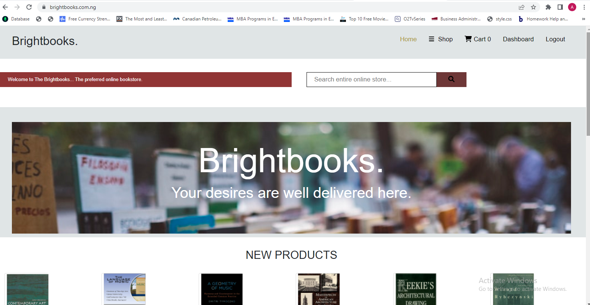
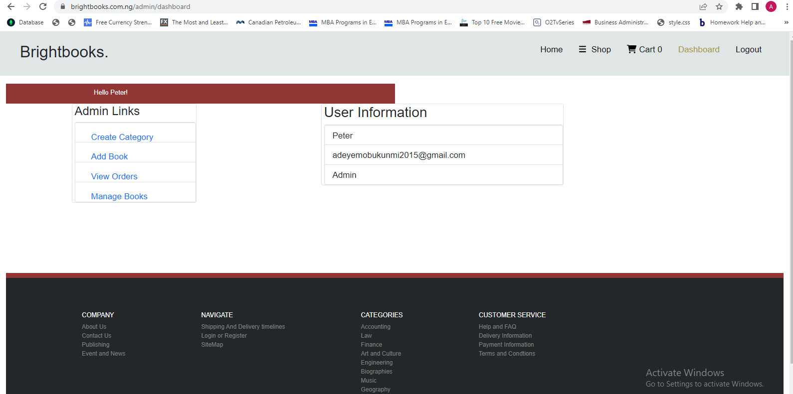
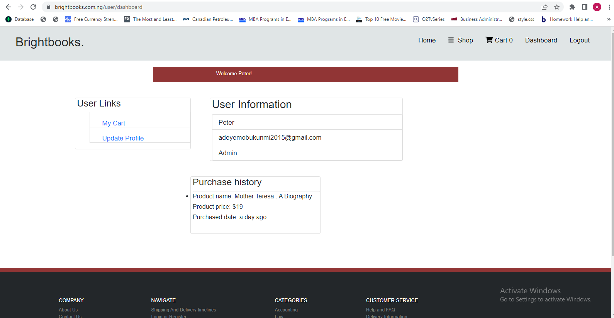
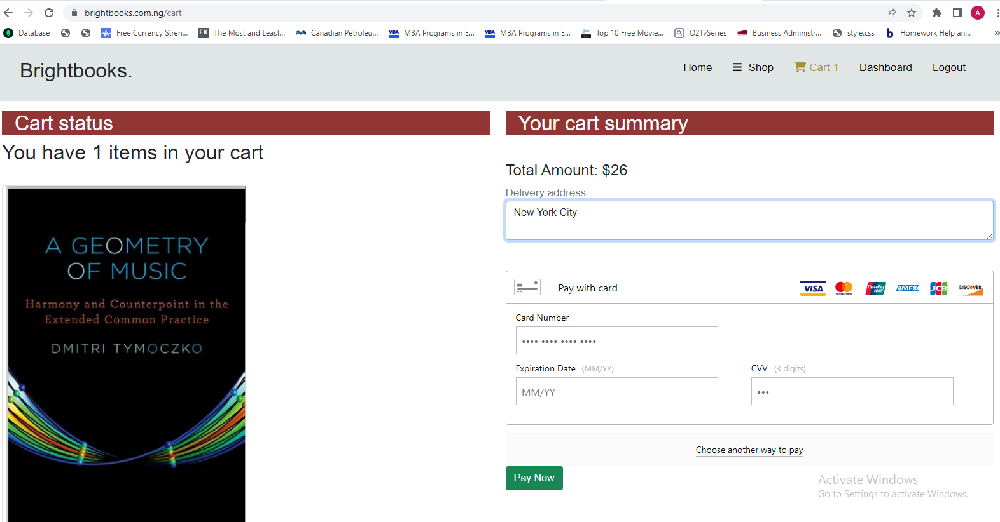
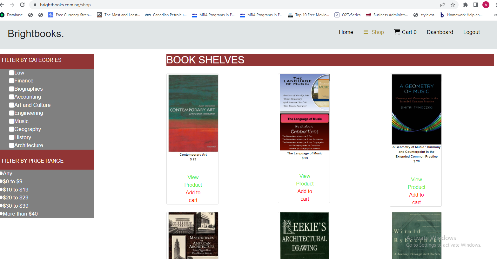

## Introduction:

Brightbooks is a functional MERN Stack Ecommerce bookstore web App where Admin and Customers have different dashboards to interact with the app. The App has the following special features:
a. User friendly Home Page with Bestellers books and newly added books (New products)
b.Admin can add books, update books, add categories of books.
c. Admin can manage the orders with update options of "Shipped", "Delivered", "Cancelled", "processed" or "not processed".
d.Customers can view book details ( Price, Author, description).
e. Customers can add and remove books from cart
f. Customers can make payment using their Bank Cards or PayPal Accounts.
g. Customers can filter books by category and price range
h. Customers can see their purchase history

_Hosting Server: DigitalOcean._
App website: brightbooks.com.ng

Requirements
In order to run Brightbooks you will need the following server configurations for hosted and local serves. The system compatibility will also be checked by the system with installation and if the server is not compatible then the installation will not move ahead.

```javascript
Client Rendering:React,
Node version: 5.0+
Mongo version: 5.0+ and below 5.7 installed with a database created
SSH or FTP access (ask your hosting service for your credentials)
SSL certificate if you plan to process payments internally (Card and Bank Card PayPal for instance)
Required PHP extensions: cURL, SimpleXML, SOAP
Local Server Configurations
Supported operating system: Windows, Mac, and Linux
Required Node extensions: Rest API (postman)

```

## Front Page



## Admin Dashboard



## User Dashboard



## Cart and payment Page



## Shop Page



## Contribute

A MERN Stack developer who has command on Node and Mongo and also knows how to use Git or GitHub efficiently, can contribute to code enhancements via pull requests.

Credits @GMTsoftware
